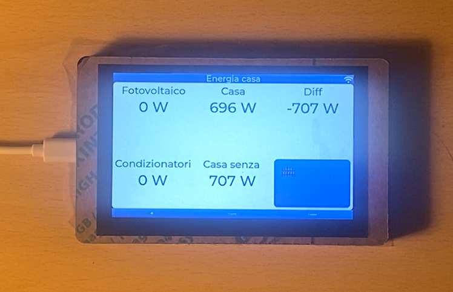
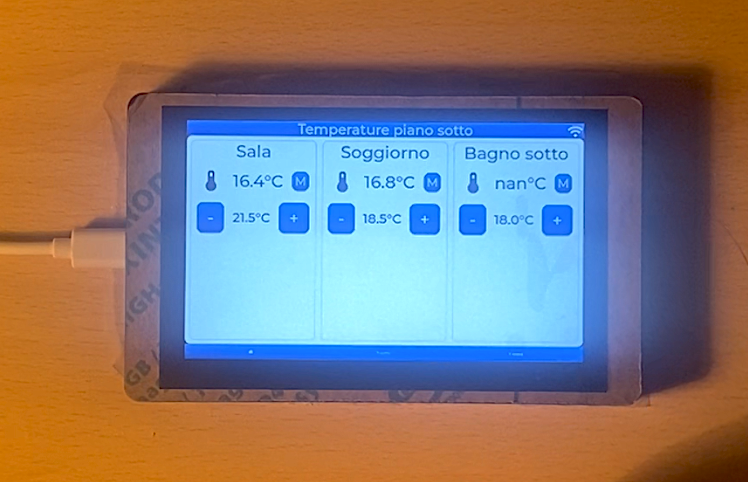
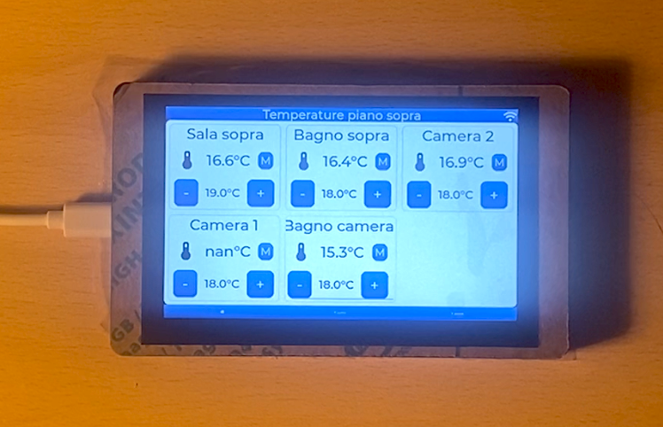

# Esp based touch screen

This repository contains the [ESPHome](https://esphome.io) configuration code for programming the [Elecrow ESP32-based 5-inch touchscreen display](https://www.elecrow.com/esp32-display-5-inch-hmi-display-rgb-tft-lcd-touch-screen-support-lvgl.html?idd=6) I've used. The project implements a three-page navigation interface with a bottom navigation bar and a top title bar for each page.

The panel will be mounted in a wall and used as a central control panel for home temperatures interacting with [HomeAssistant](https://www.home-assistant.io).

## Table of contents
- [Features](#features)
  - [Images](#images)
  - [Navigation](#navigation)
  - [Pages Overview](#pages-overview)
    - [Energy Page](#energy-page)
    - [Ground Floor Temperature Page](#ground-floor-temperature-page)
    - [First Floor Temperature Page](#first-floor-temperature-page)
  - [Anti burn and auto turn off](#antiburn-and-auto-turn-off)
- [Code](#code)
- [Future implementations](#future-implementations)
- [Contribution](#contribution)
- [License](#license)

## Features
You can find a well detailed decoumentation on EspHome on the following links that will better help you to understand the example code:
- https://esphome.io/components/lvgl/widgets
- https://esphome.io/cookbook/lvgl#

### Images
First of all, since an image explain more then 1000 words, here below you can see a bad quality photo for each page:
- Energy page
 
- Ground floor temperature page

- First floor temperature page

### Navigation
- **Three Pages**: Navigate between pages using the bottom button bar.
- **Page Titles**: Each page displays a title at the top.
- **Page Titles**: Elements in the page are shown using grid or flex leyout positioning.

### Pages Overview
The interface interacts with HomeAssistant API to have sensor information and display the following pages.

1. **Energy Page**:
The page disply the following datas, taken from my costum [esp energy meter](https://github.com/zioCristia/esp-energy-monitor-v2):
   - Displays solar panel power production.
   - Shows home power usage.
   - Shows the difference between the above two.
   - Includes air conditioning (AC) power usage.
   - Shows the home power usage without AC.
   - A button to activate the gate (not yet activated).

2. **Ground Floor Temperature Page**:
The page disply the following datas, taken from my costum [esp room thermometer](https://github.com/zioCristia/esp-room-thermometer):
   - Displays temperature and humidity for ground floor rooms.
   - Allows increasing or decreasing the set temperature for each room.
   - Provides an option to change the room mode (automatic or manual).
   - Future integration with Home Assistant for room temperature regulation.

3. **First Floor Temperature Page**:
   - Similar to the ground floor page but for first-floor rooms.
   - Displays temperature and humidity for first-floor rooms.
   - Includes controls for adjusting set temperatures and changing modes.

### Antiburn and auto turn-off
The code is included with an automatic turn off of the screen after 45s of inactivity, that will follow an antiburn feature to prevent the screen from burn-in after some times of activity.
Re-clicking the screen will disactivate the antiburn feature and turn on the backlight.

More information about these features can be read in EspHome documentation at the follwing links:
- [Turn off screen when idle](https://esphome.io/cookbook/lvgl#turn-off-screen-when-idle).
- [Prevent burn in of lcd](https://esphome.io/cookbook/lvgl#prevent-burn-in-of-lcd).

## Code
The ESPHome configuration is located in [`esp-home-code-example.yaml`](./esp-home-code-example.yaml). It defines the behavior of the touchscreen interface, including widgets, navigation, and integration with sensors and actuators.

## Future implementations
Here listed are availables future ideas that will be implemented in the touch screen interface:
- **Dark theme**.
- **Room temperature regulation**. Interaction with HomeAssistant to control room temperature and room mode. The `A` stands for automatic mode, while the `M` for manual mode. The automatic mode will follow a scheduled desidered room temperature that will possibly change based on the hour of the day and the day of the week. The manual mode will change the current desired temperature without modifying the scheduled one.
- **DHT22 sensor addition**. A DHT22 sensor will be added to the screen to monitor the temperature and himidity of the room in which the screen will be mounted. Currently those values are retrieved thanks to a [costum esp room thermometer](https://github.com/zioCristia/esp-room-thermometer). 

## Contribution
Feel free to report any bugs or feature requests.

## License
This project is licensed under the [MIT License](./LICENSE). See the `LICENSE` file for details.